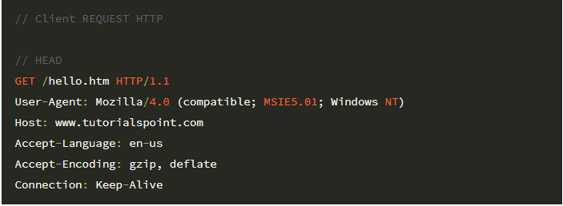

# 학습 계획

이번 핵심 키워드는 `HTTP`, `소캣`, `TCP/IP`, `네트워크` 이 4가지 키워드에 대해 집중적 으로 학습하며 정리해본다.
추가적으로 `WAS`, `스레드와 프로세스` , `멀티프로세스 프로그래밍,멀티 스레드` 에 대해 공부한다.

mvc 패턴을 직접 구현해보며 응답 요청을 어떤식으로 보내고 관리 하는지 이해한다.
# 소켓 통신이란

## 소켓이란

- 컴퓨터(Server)와 컴퓨터(Client)를 연결해 주는 도구, 소켓은 양쪽 끝점이 되는 IP 주소와 포트 번호로 구성
- 소캣이란 사실 `파일`이다. 그렇다면 `파일`은 무엇인가? 파일이란 운영체제 영역의 추상화된 인터페이스 만약 이 파일이 프로토콜요소에 관한 것이다?
  이것을 `소켓`이란한다. 여기서 대상체 file이 TCP/IP면 이것을 TCPSorket이라한다.
- 소켓을 사용할때
  - 클라이언트(브라우저)에서 오는 모든 데이터는 InputStream에 담겨있다. OutputStream은 반대이다.
  - InputStream은 그냥 다루기 쉽지 않기 때문에 `BufferedReader`를 사용한다.
- 양방향 연결 지향성 통신이다.

소켓은 프로세스와 프로세스간의 데이터를 주고 받기 위한 기술

## port란

포트 번호란 프로세스 식별자.

## 이더넷

유선렌 기술의 일종

# was

was 의 개념, web 서비스의 3계층에서의 was의 역할, web 서버,db와의 차이 연관 관계 학습
was 는 동적인 페이지를 만든다.

> 참고자료 : https://tecoble.techcourse.co.kr/post/2021-05-23-servlet-servletcontainer/

## was 개념

was안에는 매우 중요한 `서블릿 컨테이너` 라는 것이 있고 여기서 서블릿 객체들이 만들어진다. 이 서블릿 컨테이너를 통해 HttpRequest
가 들어오면 HttpResponse를 응답 해주는 것이며 서블릿 에는 HttpServletRequest HttpServletResponse 등을 사용한다.
응답 요청을 최대한 순서에 맞게 구현해 보며. 더 나아가 서블릿 컨테이너, 서블릿에 대해 학습해본다.

## was의 역할

## was의 기능

## web service의 구조

## 서블릿

# 3계층 구조(3 Tier- Architecture)

3계층 구조의 각자의 역할과 차이점, 3계층을 함으로서의 장점에 대해 학습해 본다.

# MVC
서블릿은 컨트롤러고 jsp는 뷰이다.

## mvc 패턴에서는 프론트 컨트롤러 패턴을 사용한다

공통된 로직을 먼저 수행하는 프런트 컨트롤러 -> 추상 클래스 컨트롤러 보통은  HttpServlet을 상속받는다.

> 참고자료: https://everenew.tistory.com/260
# http

## Http Request의 모습

# 프로토콜

지금 까지 프로토콜이 무엇이냐? 라고 질문을 받으면 명확히 대답하기 어려웠다 이번 기회에 프로토콜의 개념. 더나아가 미션과 관련있는 `MIME`에 대해 학습한다.

# 테스트 코드

이번 미션을 진행 하면서 좋은 테스트란 무엇인지 진지 하게 고민해본다 `단위 테스트` 에대해 학습한다.

## 단위 테스트란?

## 좋은 테스트란?

# 멀티스레드 프로그래밍

## 스레드

- run 과 start의 차이
  start() 메서드를 호출하면 새로운 스레드를 생성하고 해당 스레드에서 run() 메서드를 실행시키며, run() 메서드를 직접 호출하면 현재 스레드에서
  run() 메서드를 실행시키게 됩니다.

# 네트워크

지난 cs기간 학습한 멀트스레드 프로그래밍을 복습하며 추가적으로 보완한다. 구체적으로 이번 미션인 was와 멀티 스레드 프로그래밍의 연관관계에 대해
고민 해본다.

- 이 프로젝트는 우아한 테크코스 박재성님의 허가를 받아 https://github.com/woowacourse/jwp-was
  를 참고하여 작성되었습니다.

# 파일 입출력에 대해 생각해 보자.

유닉스는 모든 입출력을 파일로 관리한다.
왜 파일 식별자는 3부터 시작할까 ?? 0, 1 , 2는 누구일까 정답 파일 입출력, 에러 처리

리눅스의 파일 시스템에 대해 공부해보자.

리드 시스템 콜의 내부동작

# 운영체제란

결국엔 운영체제란 하드웨어를 다루는 소프트웨어다. 현대 운영체제는 하드웨어를 보호하면서 사용자를 제어한다.
사용자가 운영체제를 제어하고 싶으면 `시스템 콜`을 하면된다.

좁은 의미의 운영체제 `커널`

# 커널 공간 유저 공간

# 스레드 풀

> 참고 자료 : https://steady-coding.tistory.com/548

# 미션 과정 정리

## 1단계

accept() 메서드는 블로킹 메서드로서, 클라이언트가 연결될 때까지 현재 스레드를 대기시킵니다. 만약 클라이언트의 연결 요청이 수락되면,
Socket 객체를 반환하고 다음 클라이언트의 연결 요청을 대기합니다

# 이번 달 주 목표

- 김영한님 강의를 복습해보자.http 강의 다 듣기
- 박재성님의 next step읽어보기
  
